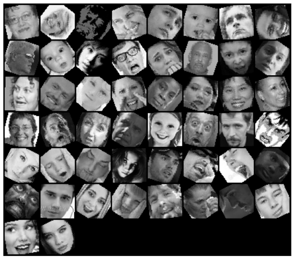

# Emotion-Detection-Using-CNN
Pytorch is used to train the data in order to generalize the machine learning model to predict emotions, given an image or live feed video

Training Dataset

In order to download the dataset, visit [link to Dataset!](https://www.kaggle.com/jonathanoheix/face-expression-recognition-dataset)

The architecture of the machine learning model

Result:

