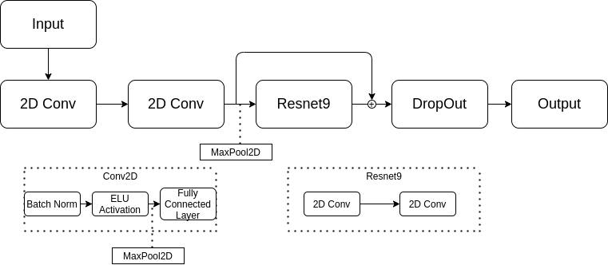

# Emotion-Detection-Using-CNN
Pytorch is used to train the data in order to generalize the machine learning model to predict emotions, given an image or live feed video

In order to download the dataset, visit  https://www.kaggle.com/jonathanoheix/face-expression-recognition-dataset
The architecture of the machine learning model

Result:

